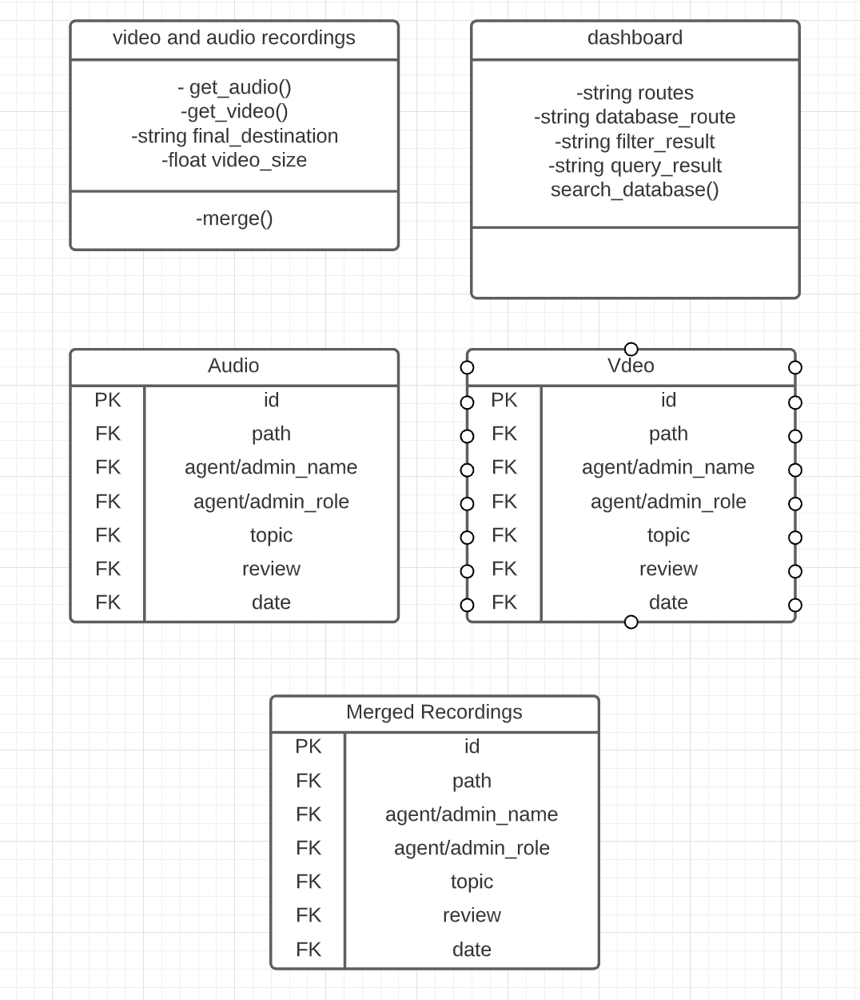
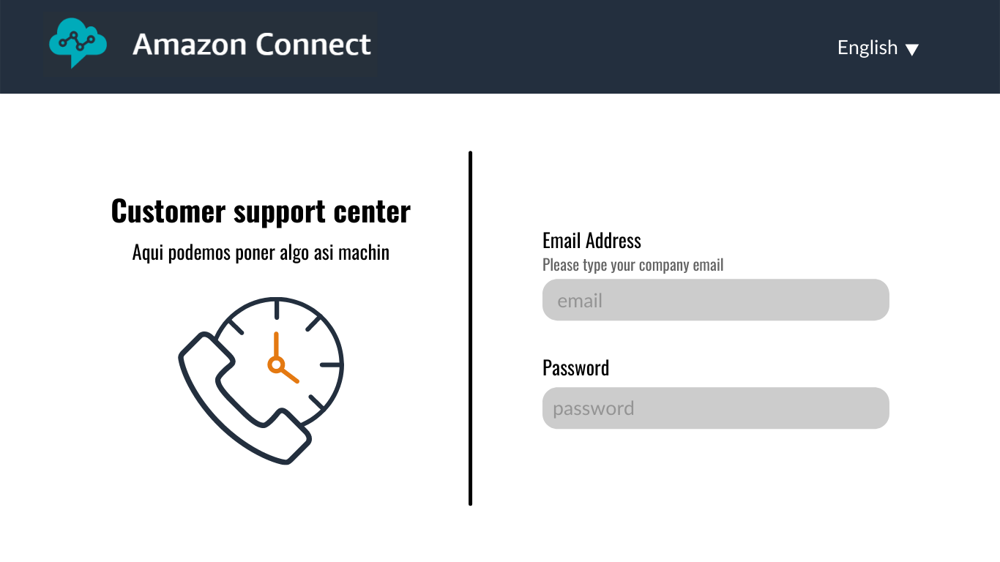
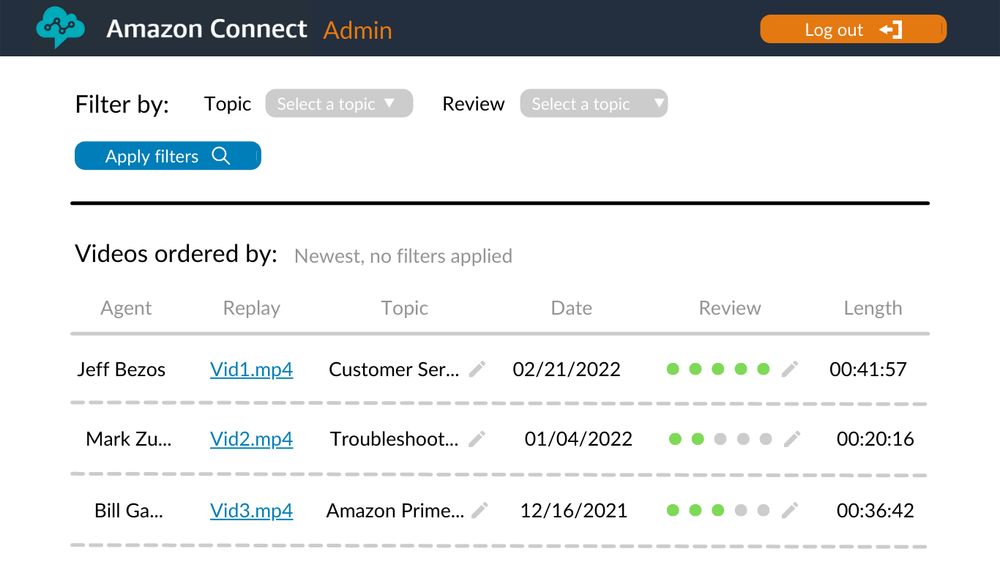
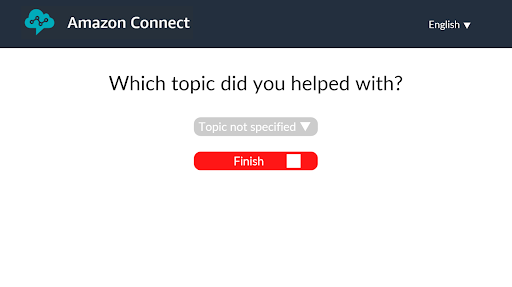
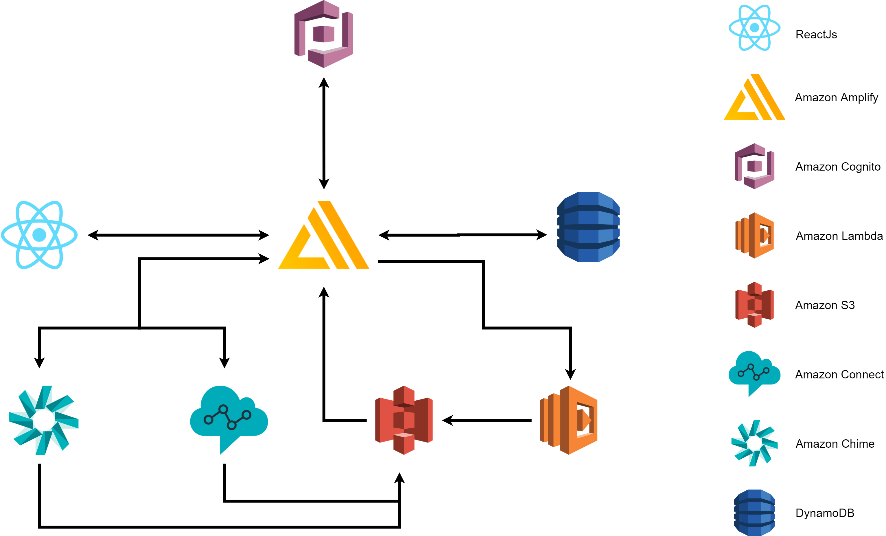
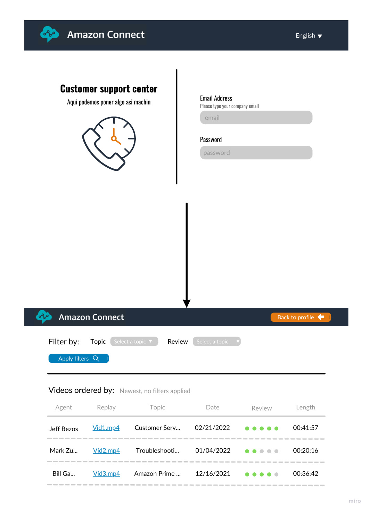

### Team: 
3

### Version: 
1.0

### Date: 
02/03/2022

### Team Name: 
APD

### Business / Operations Sponsor:
Amazon & Tecnológico de Monterrey

### Project Number:
3

 

## Content Table

1. [Template Change History](#template-change-history)
2. [General Project Information](#general-project-information)
3. [Scope Statement](#scope-statement)
4. [Introduction](#introduction)
5. [Description/Objectives](#description/objectives)
6. [Governance Model](#governance-model)
7. [Budget/Costs](#budget/costs)
8. [S.W.O.T](#s.w.o.t)
9. [Justification](#justification)
10. [Constraints](#constraints)
11. [Dependencies](#dependencies)
12. [Risks](#risks)
13. [Product Acceptance Criteria](#product-acceptance-criteria)
14. [Business Requirements](#business-requirements)
- 14.1 [System Features](#system-features)
- 14.2 [Data Requirements](#data-requirements)
- 14.2.1 [Logical Data Model](#logical-data-model)
- 14.2.2 [Data Dictionary](#data-dictionary)
- 14.2.3 [Reports](#reports)
- 14.2.4 [Data Acquisition, Integrity, Retention, and Disposal](#data-acquisition,-integrity,-retention,-and-disposal)
- 14.3 [External Interface Requirements](#external-interface-requirements)
- 14.3.1 [User Interfaces](#user-interfaces)
- 14.3.2 [Software Interfaces](#software-interfaces)
- 14.3.3 [Hardware Interfaces](#hardware-interfaces)
- 14.3.4 [Communication Interfaces](#communication-interfaces)
- 14.4 [Quality Attributes](#quality-attributes)
- 14.4.1 [Usability](#usability)
- 14.4.2 [Performance](#performance)
- 14.4.3 [Security](#security)
- 14.4.4 [Safety](#safety)
- 14.5 [Internationalization and Localization Requirements](#internationalization-and-localization-requirements)
15. [FlowChart](#flowchart)
16. [Define & Design Solution](#define-&-design-solution)
17. [Proposed Architecture](#proposed-architecture)
18. [Implementation Plan](#implementation-plan)
19. [Test Solution](#test-solution)
- 19.1 [Objectives](#objectives)
- 19.2 [Scope](#scope)
- 19.3 [Requirements for Testing](#requirements-for-testing)
- 19.4 [Dependencies](#dependencies)
- 19.5 [Testing Strategy](#testing-strategy)
- 19.6 [Testing Management Process](#testing-management-process)
- 19.7 [Testing Environment](#testing-environment)
- 19.8 [Testing Results](#testing-results)
- 19.9 [Conclusions](#conclusions)
- 19.10 [Appendix](#appendix)
20. [Endings](#endings)
21. [Glossary of Term and Acronyms](#glossary-of-term-and-acronyms)

## Template Change History

| Date of Change | Owner of Change | Description |
| -------------- | --------------- | ----------- |
| 02/03/2022     | Team 3          | First version |

## General Project Information

### 1. List of project Reviewers 

| ID | Role | Name |
| -------------- | --------------- | ----------- |
| 1    | Professor          | Gilberto Echeverria |
| 2    | Professor          | Esteban Castillo |
| 3    | Professor          | Alan ROjas |
| 4    | Professor          | David Iturriaga |
| 5    | Professor          | Jose Eslava |

### 2. List of Approvals

| ID | Role | Name |
| -------------- | --------------- | ----------- |
| 1    | Professor          | Gilberto Echeverria |
| 2    | Professor          | Esteban Castillo |
| 3    | Professor          | Alan ROjas |
| 4    | Professor          | David Iturriaga |
| 5    | Professor          | Jose Eslava |

### 3.  Scope Statement

The main goal of this project is to provide Amazon Connect Customers a platform that will facilitate training of new call center employees. This will be done by gathering critical information about everyday agent and client interactions, so it can later be revised and used to teach new employees based on real world scenarios. 

### 4. Introduction

In the following document we will describe how this project is going to be developed, outlining the business requirements, system requirements, objectives, architecture, roadmap, risks, dependencies, implementation, tests, and maintenance of the application.

### 5. Description/Objectives

Our main goal for this project is to be able to gather the screen and audio recording of an agent interacting with a client, for it to later be stored. From there, these recordings should be merged creating a video where you can see and hear how the agent works as he’s interacting with the client.

The merged recordings should be available to the call center manager by means of a web app dashboard. Through this dashboard the manager should be able to see, review and categorize each video.

### 6. Governance Model

- **Sponsor:** Amazon & ITESM
- **Supervisors:** All Professors of the Software Planning Course
- **Project Manager:** Carolina Ortega
- **Business Analyst:** Ximena Gonzalez
- **Architect:** Matías Ricardo Méndez Sandoval
- **Developer:** Sebastian Juncos
- **Tester:** Mateo González Cosío Ríos y Valles

### 7. Budget/Costs

For the development of this project our sponsor, Amazon, has given us 600 dollars. Knowing that there will be two development groups working on a solution, **we have estimated that our budget is 300 USD.** 

- #### **Infrastructure**
    - Amazon Amplify
        
        This service is charged by the amount of build minutes we are going to utilize, as well as how much data we will be storing and serving a month. We are estimating that at most our build time should be between 15 and 20 hours each month, and storing and serving about 1GB of data. **Our cost estimate is 12.17 USD per month**.
    
    - Amazon DynamoDB

        This service is charged by the amount of storage we are going to be using, as well as how many writes and reads we will do. Estimating we will be using about 25 GB of storage and making about a million consistent writes and read to our database, **our cost estimate is 7.75 USD a month**.

    - Amazon S3 Storage

        This service is charged by the amount of storage we are going to use to store our video and audio recordings. As well, we are charged for the amount of requests we make to this storage. This is one of the most critical components of our infrastructure, so estimating we would need about 1TB of storage a month, and about 20,000 requests per month. **Our cost estimate is 26.37 USD per month.**

    - Amazon Lambda

        This service is charged by the amount requests and length of such requests we are going to make per month. Estimating we should be making around 10,000 requests a month, each one taking about 5 minutes to complete. **Our cost estimate is 17.75 USD per month.**

    - Amazon Cognito
    
        This service charges you for the amount of monthly active users are signing into your application. For the moment we are planning to use the free tier of this service that allows us to manage 50,000 active users. **Our cost estimate is 0 USD per month.**

    - Amazon Kinesis
        
        This service is charged by the amount of streams made by minute, the charge is monthly. If we record and store 200 videos a month of size 1 MB, **Our cost estimate is 1 USD per month.**

    - Amazon Connect
        
        This service is charged by minute, each minute costs 0.0070 USD. If we estimate 200 calls of 5 minutes each per month, **Our total monthly cost is 7 USD.**

**Our cost estimate is 72.04 USD per month.**
### 8. S.W.O.T

- #### Strengths
    - Experience making friendly UI
    - Experience developing web applications
    - Experience hosting web services
- #### Weaknesses
    - No Amazon API or Amazon services knowledge
    - Never managed a team this big
- #### Opportunities
    - Ability to use Amazon API's and services to facilitate development
    - Code Review
    - Amazon support and supervision
- #### Threats
    - Poor communication with Amazon
    - Surpass cost budget
    - Poor time management

### 9. Justification

In  this day and age, customer support is extremely important for any company.  Amazon Connect is already helping their clients provide top of the line service to their customers, but as each company grows their clientele gets bigger and the necessity to hire call center agents increases. Our project aims to facilitate the training of these new call center agents by providing call center managers a platform to teach each agent with real world scenarios. This platform will facilitate and expedite training new agents assuring they maintain the quality of customer service experience. 

### 10. Constraints

- Amazon services exclusivity 
- A 300 dollar budget for all Amazon services used during the development
- Limited contact with Amazon representatives
- A 10 week development period
- A 5 week planning period

### 11. Dependencies

- Amazon services and API's

### 12. Risks

- Low Level Risks
    - Exceed the expected database storage.
    - Low video quality recordings.
    - Unintelligable audio recordings.
    - Exceeding budget cost estimate.

- Medium Level Risks 
    - Video Recordings not being saved properly.
    - Data leaks.
    - Failure to encrypt user information.

- High Level Risks
    - Failure to record screen recording.
    - Failure to merge audio and video recodings.
    - Choosing a wrong Amazon service to develop the solution.
    - Incorrect management of users permissions.
    - Sensitive data leak.

### 13. Product Acceptance Criteria

- The web app should only give access to the video catalog if the user is a call center manager.
- The security implemented should recognize personal data. 
- The recordings should download correctly into our databse following the tags given.
- The call center manager should be able to see all the recordings that were made.

### 14. Business Requirements
- ### 14.1 System Features
    - **Voice and Screen Recording**
        
        Our application should be able to record the call center agent screen, gather the voice recording from a Amazon cConnect database and merge audio and video.

        - **Description**
            
            For the fulfillment of this requirement, we will introduce two components:

            **Video and Audio Recording Component**

            
            
            

            **Merge Video and Audio Recording Component**
            
            
            
            

        
        - **Stimulus/Response Sequence**

            **Video and Audio Recording Component**

            

            **Merge Video and Audio Recording Component**

            

        - **Functional Requirements**

        | ID | VACN1 |
        | --- | --- |
        | Name |  Global Screen and Audio Recording Component.  |
        | Description | Defintion of top level functionality of this component.|
        | Scenery | A customer calls a Amazon Connect Client Call Center. |
        | Exceptions | Call Lasts less that 10 seconds. |
        | Pre-conditions | Call Recieved. |
        | Post-Contitions| Agents categorizes call. |
        | Acceptance Criteria | Call Recieved and correctly started recording process. |

        | ID | VACN2-1 |
        | --- | --- |
        | Name |  Voice Recording Detailed  |
        | Description | Definition of how we use Amazon Connect to record a call. |
        | Scenery | A customer calls a Amazon Connect Client Call Center. |
        | Exceptions |  Call Lasts less that 10 seconds. |
        | Pre-conditions | Call Recieved and correctly started recording process. |
        | Post-Contitions| Audio Stored in S3 Storage and path sent to Amazon Amplify. |
        | Acceptance Criteria | Voice recording correctly stored and path correctly sent to Amazon Amplify. |

        | ID | VACN2-2 |
        | --- | --- |
        | Name |  Screen Recording Detailed  |
        | Description | Definition of how we use the Screen Recording Component to record the agent's screen |
        | Scenery | A customer calls a Amazon Connect Client Call Center. |
        | Exceptions | Call Lasts less that 10 seconds. |
        | Pre-conditions | Call Recieved and correctly started recording process. |
        | Post-Contitions| Video Stored in S3 Storage and path sent to Amazon Amplify. |
        | Acceptance Criteria | Screen recording correctly stored and path correctly sent to Amazon Amplify. |

        | ID | MAVCN1 |
        | --- | --- |
        | Name | Merge Audio and Screen Recording Component |
        | Description | Defintion of top level functionality of this component. |
        | Scenery | Both Audio and Screen recordings have been correctly stored, and are ready to be merged. |
        | Exceptions | Either Screen or Audio Recording is missing. |
        | Pre-conditions | A call has been made and both Audio and Screen recordings have been correctly stored. |
        | Post-Contitions| Storage must have sufficent space to store new recording. |
        | Acceptance Criteria | New recording correctly merged. Audio and Screen synchronisation. |

        | ID | MAVCN2-1 |
        | --- | --- |
        | Name |  Merge Audio and Video Screen Recording Architecture  |
        | Description | Definition of the Amazon Service we are going to use for our component. |
        | Scenery | Both Audio and Screen recordings have been correctly stored, and are ready to be merged. |
        | Exceptions | Either Screen or Audio Recording is missing. |
        | Pre-conditions | A call has been made and both Audio and Screen recordings have been correctly stored. |
        | Post-Contitions| Storage must have sufficent space to store new recording. |
        | Acceptance Criteria | New recording correctly merged. Audio and Screen synchronisation. |

        | ID | MAVCN2-2 |
        | --- | --- |
        | Name | Merge Audio and Screen Recording Component Functionality  |
        | Description | Definition of how the functionality of this component. |
        | Scenery | Both Audio and Screen recordings have been correctly stored, and are ready to be merged. |
        | Exceptions | Either Screen or Audio Recording is missing. |
        | Pre-conditions | A call has been made and both Audio and Screen recordings have been correctly stored. |
        | Post-Contitions| Storage must have sufficent space to store new recording. |
        | Acceptance Criteria | New recording correctly merged. Audio and Screen synchronisation. |

    - **Storage and Data Upload**

        Our application should be able to store and upload data inside an Amazon Connect S3 Bucket. The data stored can be filtered by the used video metadata. (Tags, Day, Hour, etc.)

        - **Description**

        

        - **Stimulus/Response Sequence**

        

        - **Functional Requirements**

        | ID | SDCN1 |
        | --- | --- |
        | Name | Storage and Data Upload Component |
        | Description | Definition of how this component will work. |
        | Scenery | Voice and Screen recordings have been made and are in need of storage and categorization. |
        | Exceptions | Voice and Screen recording has failed. |
        | Pre-conditions |  A customer calls a Amazon Connect Client Call Center, and the Audio and Screen Recording Component has succesfully recorded and stored the customer's voice and the agent's screen. |
        | Post-Contitions| |
        | Acceptance Criteria | Recordings correctly stored and are available to be retrieved. |

    - **Dashboard View**

        Our application should be able to show and filter the catalog of recordings stored in our database. From this screen the administrator should be able to view, edit tags, review, and delete each video shown.

        - **Description**

        
        
        
        - **Stimulus/Response Sequence**

        

        - **Functional Requirements**

        | ID | DCN1 |
        | --- | --- |
        | Name | Dashboard Component  |
        | Description | Definition of how this component is going to work. |
        | Scenery | A call center manager access our application platform with the right credentials. |
        | Exceptions | The call center manager doesn't have the right credentials. |
        | Pre-conditions | Both the Video and Audio Recording component and the Storage and Data Upload component are working correctly. |
        | Post-Contitions| |
        | Acceptance Criteria | The call center manager is able to interact with each video in the database. |

        | ID | DCN2-1 |
        | --- | --- |
        | Name | Retrieve merge video. |
        | Description | Definition of how our dashboard component communicates with the Storage and Data Upload component to retrieve a specific video. |
        | Scenery | A call center manager access our application platform with the right credentials. |
        | Exceptions | The call center manager doesn't have the right credentials. |
        | Pre-conditions | Both the Video and Audio Recording component and the Storage and Data Upload component are working correctly. |
        | Post-Contitions| |
        | Acceptance Criteria | The call center manager is able to interact with each video in the database. |

- ### 14.2 Data Requirements
    - #### 14.2.1 Logical Data Model
    
    - #### 14.2.2 Data Dictionary

        | AUDIO | --- |
        | --- | --- |
        | ID| Identifier    |
        | path | Path to the service where the file is stored.|
        | agent_name | Name of agent. |
        | agent_role | Role of agent. |
        | topic | Topic of the audio. |
        | review| Rating review from 1-5. |
        | date | Date of the audio. |

        | VIDEO | --- |
        | --- | --- |
        | ID| Identifier    |
        | path | Path to the service where the file is stored.|
        | agent_name | Name of agent. |
        | agent_role | Role of agent. |
        | topic | Topic of the video. |
        | review| Rating review from 1-5. |
        | date | Date of the video. |

        | MERGED RECORDINGS | --- |
        | --- | --- |
        | ID| Identifier    |
        | path | Path to the service where the file is stored.|
        | agent_name | Name of agent. |
        | agent_role | Role of agent. |
        | topic | Topic of the recording. |
        | review| Rating review from 1-5. |
        | date | Date of the service given. |

    - #### 14.2.3 Reports
    - #### 14.2.4 Data Acquisition, Integrity, Retention, and Disposal

    Data is going to be aquired through our application integration with various Amazon AWS Services such as: Amazon Connect, Amazon DynamoDB, Amazon Amplify, and many others. As estated above our application is divided in various components in which the data is going to be distributed. 
    
    
    
   Data retention is identified as the service that keeps and stores safely certain information for a specified period of time. This service is very useful for businesses that have for example, a database where they store information of their clients throughout time and as a result businesses can analyze that data later on. It is important to specify that the storage of the information has to be stored according to the laws and regulations of the government as well as the industry sector.

    The decision of which data is going to be usable in the future is very important because if companies store too much unnecesary information there is a risk that the costs increase, to have less efficiency because the data is not filtered correctly and the security of the data might be in danger.

    It is imperative that every project that uses data retention, has data retention policies in which it says how the business is going to use the data that will be stores, if the data is protected and how, if the storage and data are secure and according to the law and how the data will be disposed after the limit time has passed.
    
   In other side, the necessary techniques to protect the app's data disposal are:

- Clearing: Clearing removes data in such a way that prevents an end-user from easily recovering it. This method is suitable for reusing devices inside your organization.
- Digital Shredding or Wiping: This method does not alter the physical asset. Instead, it overwrites data with other characters like 1 or 0 and random characters with multiple passes (e.g. DoD 5220.22-M algorithm).

- ### 14.3 External Interface Requirements
    - #### 14.3.1 User Interfaces
        - Call Center Manager

            **Log In Screen**
            
            **Dashboard**
            
        - Call Center Agent

            **Topic Selection**
        
            
    - #### 14.3.2 Software Interfaces
        - **Amazon Amplify**

            Amazon Amplify serves as the heart of our application. Here our frontend and our backend is going to be hosted. Also, Amplify allows us to connect our app to Amazon lambda functions, Amazon S3 storage, and our Amazon DynamoDB database. 

            Amazon Amplify allows us to connect all these services by using their CLI, and on top of that it let’s us create a continuous integration and continuous development workflow.

            Through the Amplify API we will be able to connect all our application components with ease.
        
        - **Amazon Connect**

            Amazon Connect is a critical component of our application because it connects us directly with the call center. Here we can see how calls are rooted, how agents interact with customers and most importantly it allows us to save the voice recording of the call into an S3 bucket instance. 

        - **Amazon Lambda**

            The Amazon Lambda API will serve as our merge component. Through this service and their respective API’s, we will be able to connect to Amazon Amplify and our storage hosted in Amazon S3. This completes a critical part in our business logic tier, which in this case will allow us to implement the appropriate solution.
        
        - **Amazon S3**

            The Amazon S3 API component is going to allow the team to store the screen and audio recording files. This Amazon Component will be accessed through the business logic tier.

        - **Amazon DynamoDB**

            The Amazon DynamoDB will be used as our primary database. Here we will store all our business data, audio and video recording paths, tags, and reviews. This service API will help us to connect it to Amazon Amplify so all our app components can access this service with ease. 
        
        - **Amazon Cognito**

            Amazon Cognito will serve as our authentication layer. It allows us to give access to the right people at the right time. With this, it gives our app an extra layer of security, assuring our clients that their information is secure.

        - **Amazon Kinesis**

            Amazon Kinesis plays an important role in our app, because it will allow us to start a screen recording as soon as a call is initiated. Through this service and their respective API, we will be able to connect it to Amazon Amplify and Amazon S3 which allows us to store and categorize the video recordings

    - #### 14.3.3 Communication Interfaces

        For communicating between the Amazon services, Amazon SQS will be used, as queuing service, wich can easily help us move information between AWS. SQS uses JSON as a way of interpreting data, therefore, JSON will be the way data moves within our application.

        

- ### 14.4 Quality Attributes
    - #### 14.4.1. Usability
    - #### 14.4.2 Performance
    - #### 14.4.3 Security
    - #### 14.4.4 Safety
- ### 14.5 Internationalization and Localization Requirements
### 15. FlowChart
- Call Center Manager's FlowChart

    
- Call Center Agent's FlowChart

    
### 16. Define & Design Solution
For this project we have identified a set of critical components that allows us to test the overall performance of the system. These components are directly tied to our functional requirements, and testing them is a necessary step in assuring the quality of our development.

These components are:
- Screen Recording
- Dashboard
- Storage

### 17. Proposed Architecture
The chosen architecture for this project is the Layers Architecture, which will allow the team to implement this project by layers in such a way that the organization and distribution of the workload will be managed in the following layers:
- **Presentation Tier:** Data visualization, User interface and interactions.
- **Logic Tier:** Business logic layer.
- **Data Tier:** Access and management of the database implemented in Amazon DynamoDB.

Thanks to this architecture, it will be easier to develop our web application with a Model-View-Controller pattern allowing the implementation of a system of components with the desired frameworks. 

### 18. Implementation Plan
version 1
| ID                           | Name of Activity/Component                              | Description and notes                                                                 | Responsible                                     | Initial Date | End Date   | Dependencies   |
| ---------------------------- | ------------------------------------------------------- | ------------------------------------------------------------------------------------- | ----------------------------------------------- | ------------ | ---------- | -------------- |
| 1.1                          | Capture of business requirements                        | Remote session with Amazon  to capture business requirements                          | Every team member                               | 16/02/22     | 17/02/22   |                |
| 1.2                          | Business Requirements Revision with Amazon              | Remote session with Amazon  to ask final questions about the business requirements    | Carolina Ortega                                 | 23/02/22     | 23/02/22   | 1.1            |
| 1.3                          | Business Requirements Revision with Advisors (teachers) | Session with teachers to correct details                                              | Every team member                               | 7/03/22      | 11/03/22   | 1.1      |

**Presentation Tier Implementation (Front-end)**

| ID                           | Name of Activity/Component                              | Description and notes                                                                 | Responsible                                     | Initial Date | End Date   | Dependencies   |
| ---------------------------- | ------------------------------------------------------- | ------------------------------------------------------------------------------------- | ----------------------------------------------- | ------------ | ---------- | -------------- |
| 2.1                          | User Interface Design                                   | Proposal design of app interfaces and navigation with Canva                           | Sebastián Juncos                                | 22/02/2022   | 22/02/22   | 1.3            |
| 2.2                          | Start page interface                                    | Implementation of Start page interface                                                | Carolina Ortega                                 | 22/03/2022   | 28/03/2022 |                |
| 2.3                          | Start/Stop and Save Recording component                 | Implementation of the screen recording tool with Angular                              | Matías Méndez                                   | 22/03/2022   | 08/04/22   |                |
| 2.3                          | Admin interface to add video information                | Implementation of interface to edit the information of the stored videos with Angular | Ximena González                                 | 22/03/22     | 08/04/22   |                |
| 2.5                          | Integration of all the components                       | Integration of all of the front-end components                                        | Every team member                               | 31/03/22     | 14/04/22   | 2.2 , 2.3,2.4  |
| 2.6                          | Front-end testing                                       | Test all of the interface components                                                  | Mateo Gónzalez                                  | 14/04/22     | 18/04/22   | 2.5            |
| 2.6                          | Team meeting                                            | Team meeting to discuss advances and areas of opportunity                             | Every team member                               | 6/04/22      | 6/04/22    |                |

**Data Tier Implementation**

| ID                           | Name of Activity/Component                              | Description and notes                                                                 | Responsible                                     | Initial Date | End Date   | Dependencies   |
| ---------------------------- | ------------------------------------------------------- | ------------------------------------------------------------------------------------- | ----------------------------------------------- | ------------ | ---------- | -------------- |
| 3.1                          | Database planning and design                            | Identify the required tables, relations, and columns for the database                 | Every team member                               | 22/03/22     | 23/03/22   |                |
| 3.2                          | Database implementation                                 | Implement the design of the database with the desired language and server             | Carolina Ortega, Matías Méndez, Ximena Gonzalez | 24/03/22     | 29/03/22   | 3.1            |
| 3.3                          | Database Testing                                        | Test the functionality of the database with the appropriate tools                     | Mateo Gonzalez and Sebastián Juncos             | 30/03/22     | 2/04/22    | 3.2            |
| 3.4                          | Team meeting                                            | Team meeting to discuss advances and areas of opportunity                             | Every team member                               | 6/04/22      | 6/04/22    |                |

**Back-end Tier Implementation**

| ID                           | Name of Activity/Component                              | Description and notes                                                                 | Responsible                                     | Initial Date | End Date   | Dependencies   |
| ---------------------------- | ------------------------------------------------------- | ------------------------------------------------------------------------------------- | ----------------------------------------------- | ------------ | ---------- | -------------- |
| 4.1                          | API                                                     | API to connect the Front-end interaction with the database                            | Every team member                               | 19/04/22     | 25/04/22   | 3.3, 2.5       |
| 4.2                          | API Testing                                             | Test the functionality of the API with the appropriate tools                          | Mateo Gonzalez and Sebastián Juncos             | 26/04/22     | 30/04/22   | 4.1            |
| 4.3                          | Team meeting                                            | Team meeting to discuss advances and areas of opportunity                             | Every team member                               | 31/04/22     | 31/04/22   | 4.2            |

**Final stage**

| ID                           | Name of Activity/Component                              | Description and notes                                                                 | Responsible                                     | Initial Date | End Date   | Dependencies   |
| ---------------------------- | ------------------------------------------------------- | ------------------------------------------------------------------------------------- | ----------------------------------------------- | ------------ | ---------- | -------------- |
| 5.1                          | Complete integration of the application                 | Complete integration of backend, frontend and database.                               | Every team member | 01/05/22     | 10/05/22   | 4.1, 3.2, 2.5 |
| 5.2                          | Testing of the complete application                     | Testing of all the components of the application                                      | Every team member | 11/05/22     | 20/05/22   | 5.1            |
| 5.3                          | Final software revision                                 | Final software revision and correction with advisors and Amazon if possible           | Every team member                               | 21/05/22     | 30/05/22   | 5.1 , 5.2      |
| 5.4                          | Team meeting                                            | Team meeting to discuss advances and areas of opportunity                             | Every team member                               | 31/05/22     | 31/05/22   |                |
| 5.5                          | Final presentation                                      | Final presentation with Amazon                                                        | Every team member                               | 3/06/22      | 3/06/22    |          |

version 2
|     id     | Name                             | Description                                                                   | Start date | End date | Dependencies |
|:----------:|----------------------------------|-------------------------------------------------------------------------------|------------|----------|--------------|
|  Back end  |                                  |                                                                               |            |          |              |
| 1          | Get recording data               |                                                                               |            |          |              |
| 1.1        | Start screen recording           | Start recording using Amazon Chime                                            | 1st week   | 3rd week | 1.3          |
| 1.2        | Stop recording when call ends    | Stop Amazon Chime and store S3 URL of both recordings (video, audio)          | 1st week   | 3rd week | 1.3, 1.1     |
| 1.3        | Get recording info               | Send both urls and call info to back end                                      | 1st week   | 3rd week |              |
| 2          | Merge Audio and Video            |                                                                               |            |          |              |
| 2.1        | Get video and call               | Store the video and voice recording locally                                   | 4th week   | 4th week |              |
| 2.2        | Merge locally                    | Merge the video and voice into a single file (.mp4)                           | 4th week   | 4th week | 2.1          |
| 2.3        | Upload video                     | Send the new video to S3 and store that new video’s URL                       | 4th week   | 4th week | 2.2          |
| 3          | Upload to database               |                                                                               |            |          |              |
| 3.1        | Create database entry            | Store recording information (video URL, agent’s name, length, topic)          | 5th week   | 6th week |              |
| 3.2        | Send query                       | Send query to database with new entry                                         | 5th week   | 6th week | 3.2          |
| 4          | Make available for administrator |                                                                               |            |          |              |
| 4.1        | Make database get request        | Make get request to load all videos on dashboard                              | 7th week   | 9th week |              |
| 4.2        | Send user to video               | Make a get request to get S3 video URL, then do post request to display video | 7th week   | 9th week | 4.1          |
| Front end  |                                  |                                                                               |            |          |              |
| 5          | End call                         |                                                                               |            |          |              |
| 5.1        | Display alert on browser         | Show a page where the agent can select the topic the call was about           | 3rd week   | 3rd week |              |
| 5.2        | Show upload complete             | Display a message that the call data was uploaded to the database             | 3rd week   | 3rd week | 5.1          |
| 6          | Administrator view               |                                                                               |            |          |              |
| 6.1        | Display all videos               | Show all videos that exist in the database                                    | 7th week   | 9th week |              |
| 6.2        | Filter videos                    | Apply a filter to view (topic, rating, date)                                  | 7th week   | 9th week | 6.1          |
| 6.3        | Review videos                    | Add a review to videos (store it in the database)                             | 7th week   | 9th week | 6.1          |
| 6.4        | Delete videos                    | Delete videos from database                                                   | 7th week   | 9th week | 6.1          |

### 19. Test Solution
- ####  19.1 Objectives

    Our main objective in this section is to assure that during the development cycle we do not encounter a critical system errors that forces us to redefine or redevelop any component as this will be a setback during the development stage, while also assuring the quality of our application. We intend to achive this by following the Testing Strategy and Testing Process Management defined below.   

- #### 19.2 Scope

    For this project we have identified a set of critical components that allows us to test the overall performance of the system. These components are directly tied to our functional requirements, and testing them is a necessary step in assuring the quality of our development.

    These components are: 
    - Screen and Audio Recordings
    - Merge Screen and Audio Recordings
    - Dashboard View
    - Storage and Data Upload

- #### 19.3 Requirements for Testing

    Our testing requirements can be divided into 3 subsections
    - Backend Testing
    - Frontend Testing
    - Overall Testing

    The most common testing is going to be in both Frontend and Backend testing; as for the Overall testing, this means the integration of both Frontend and Backend sections to fully finish either a function, module or component. We could call Overall testing as the Testing integration process

    Our specific requirements are:
    - We will be using a specific format for documenting our testing 
    - Have a minimum RAM capacity in order to test our app
    - Having the same version throughout the testing team in order to mantain testing performance
    - All testers should have similar specs when it comes to hardware
    - Developers must specify each testing input and output in detail, this will be shown as a comment in the code

- #### 19.4 Dependencies
  

| ID    | Name of Activity/Component                              | Description and notes                                                                  | Responsible       | Initial Date | End Date    | Depende ncies |
| ----- | ------------------------------------------------------- | -------------------------------------------------------------------------------------- | ----------------- | ------------ | ----------- | ------------- |
| 1\. 1 | Capture of business requirements                        | Remote session with Amazon to capture business requirements                            | Every team member | Week 1       | Week 1      |               |
| 1\. 2 | Business Requirements Revision with Amazon              | Remote session with Amazon to ask final questions about the business requirements      | Carolina Ortega   | 23/02/22     | 23/02/22    | 1.1           |
| 1\. 3 | Business Requirements Revision with Advisors (teachers) | Session with teachers to correct details                                               | Every team member | 7/03/22      | 11/03/22    | 1.1           |
|       | Presentation Tier Implementation (Front-end)            |                                                                                        |
| 2\. 1 | User Interface Design                                   | Proposal design of app interfaces and navigation with Canva                            | Sebastián Juncos | 22/02/20 22  | 22/02/22    | 1.3           |
| 2\. 2 | Start page interface                                    | Implementatio n of Start page interface                                                | Carolina Ortega   | 22/03/20 22  | 28/03/202 2 |               |
| 2\. 3 | Start/Stop and Save Recording component                 | Implementatio n of the screen recording tool with Angular                              | Matías Méndez   | 22/03/20 22  | 08/04/22    |               |
| 2\. 3 | Admin interface to add video information                | Implementatio n of interface to edit the information of the stored videos with Angular | Ximena González  | 22/03/22     | 08/04/22    |               |
| 2\. 5 | Integration of all the components                       | Integration of all of the front-end                                                    | Every team member | 31/03/22     | 14/04/22    | 2.2 , 2.3,2.4 |
- #### 19.5 Testing Strategy

    Our testing strategy consists in various testing levels:
    - Function Level
        - Tests whether each application feature works as per the software requirements.
    - Module Level
        - Tests each unit of these modules, we can say that it tests the smaller building blocks of the program.
    - Component Level
        - Test objects can be tested independently as components, without integrating with other components.

    For these testing levels, we will use either Black Box or White Box tests.
    Black box tests make sure of the functionality in these testing levels, wich means there is no attention to how the code works, as long as the result is the expected one.
    Black box tests will be used for Function and Module Levels.

    White box tests on the other hand, do focus on the way the conde is written without caring much for each testing result.
    White box tests will be used for Module and Component Levels.

    The normal flow of our testing process is:
    Informal Revision -> Technical Revision -> Inspection

    If any of these tests fail, we would take a step backwards to the previous testing stage, but if there's a case where technical revision fails two times, this component or module will be directly sent to inspection.

- #### 19.6 Testing Management Process
   
    - Informal Revision

        This will take place everytime a code function is completed. During this revision the developer assigned will only be performing black box tests. This revision does not require any documentation, but it is extremely important for the module that this function takes part to have all their internal functions informally revised. This is a requisite for the module to be considered for a Technical Revision. 

    - Technical Revision

        This will take place everytime a code module is completed. A team consisting of at least 3 or 5 internal members and 1 or 2 external members without surpassing the 6 total members, must meet to perform this revision. During it, mostly black box tests are meant to be done, but there is the possibiliy of making white box tests as well. For this revision it is necessary to fill out a document defined in the appendix. This is extremly important because in order for the component that this module belongs to, it is necessary that every module that takes part of it has passed this revision.  

    - Inspection

        This will take place everytime a code component is completed. A tema consisting of at least 7 or 14 internal members and 1 or 2 external members without surpassing 15 total members, must meet to perform this revision. During it, mostly white box tests are meant to be done, but there is the possibility to performing other high definition tests. For this revision it is necessary to fill out a document defined in the appendix. This is extremy important because in order to mark as our component completed and deployed it must have passed this revision. 

- #### 19.7 Testing Environment

    As mentioned in Testing Requirements (19.3), all testers need personal computers with similar hardware specifications, certain RAM space and the same software version. The input and output format will also be included as comments within the code, as diferent data types may be needed for specific procedures.

- #### 19.8 Testing Results

    To be done in next development chapter.

- #### 19.9 Conclusions

    At this stage of the project we comprehended and reflected about the basic and important requirements to be carried out, we have identified the objectives that our socio domador (in this case Amazon) has asked us to implement, and the initial stage has been completed. When we start developing the different parts like front-end and back-end of the web application, doubts will arise about the Amazon services and how we can use APIs and documentation, as well as what will be more functional and efficient to implement in the application.

- #### 19.10 Appendix

- Minutas:

https://docs.google.com/document/d/1YVaDb1OCT77fJ3wEzoixPjSeQdUWo7MZLTo0cw4uvn8/edit?usp=sharing

### 20. Endings

It is not possible to conclude anything by now since the implementation have not been started. However what should be analyzed is the performance of each developed component and its results. 
Even though we can not conclude anything, we expect the best based on our solution and our thorough description of it.

### 21. Glossary of Term and Acronyms

- #### Front-end

    - Views

        The interfaces that the user interacts with.
        
    - Filters

        The categories that a video belongs to.
        
    - React

        JavaScript library developed by Facebook to build Front-end interfaces.
    
- #### Back-end
    - Web application

        Software implementation that is rendered on web browsers

    - API 

        A set of functions and procedures allowing the creation of applications that access the features or data of an operating system, application, or other service.
    - Audio and video merge

        Software implementation where the video recorded by the web application is merged in a single file with the audio recorded by the Amazon service.
        
- #### General
    - Concept model

        Model used to organize and plan the management and distribution of data in the database. 
    
    - Scrum master

        Main supervisor of the SCRUM methodology process who usually functions as the leader of the team development.
    
    - Sprint 

        This is where ideas are turned into reality, usually there is a certain period of time (ex. 4-5 weeks) in which a part of the project is developed and as a result the value increments.
    
    - Backlog

        The pending objectives to be achieved during a project that are usually attended and followed up during sprints.
    
    - Amazon Connect

        Amazon platform that allows clients to attend their customers' needs through phone calls.
    
    - Amazon web service

        It is a cloud platform from Amazon found on the internet and it offers different API’S and computing platforms to any client.
    
    - Black box testing

        Tests that check the functional output of an implementation
    
    - White box testing 

        Tests that check the outputs of each step.
    
    - Lambda 

        This function evaluates an expression for a given argument.

